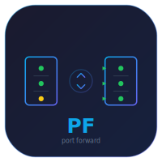
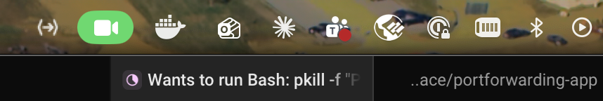
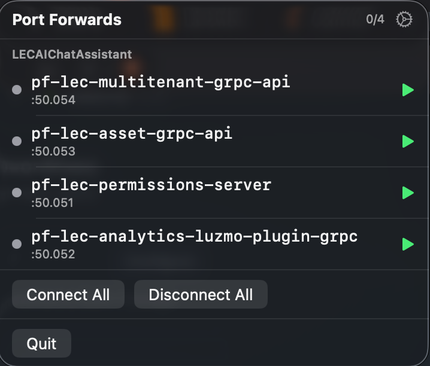
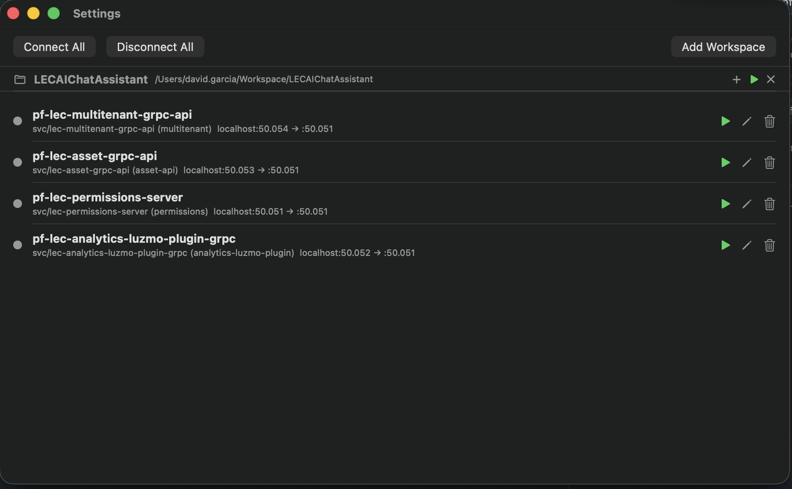
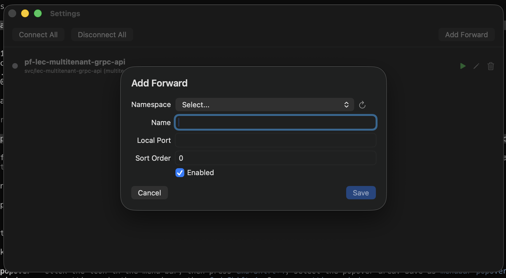

<p align="center">
  
</p>

<h1 align="center">PortForwarding App</h1>

<p align="center">
  A native macOS menu bar application for managing <code>kubectl port-forward</code> connections.<br/>
  Start, stop, and monitor multiple port forwards from a single interface instead of juggling terminal windows.
</p>

<p align="center">
  <a href="https://github.com/davidgarcials/portforwarding-app/releases/latest/download/PortForwarding.app.zip">
    
  </a>
  &nbsp;
  
  &nbsp;
  
</p>

> **Quick install:** Download the zip, extract, and run the following commands:
> ```bash
> xattr -cr PortForwarding.app
> mv PortForwarding.app /Applications/
> ```
> The app is unsigned, so macOS requires removing the quarantine attribute before launching. It will appear in your menu bar.

---

## Screenshots

### Menu bar icon
The app lives in the macOS menu bar as a minimal icon, always accessible.

<p align="center">
  
</p>

### Quick access popover
Click the icon to see all your port forwards at a glance with live status indicators and start/stop controls.

<p align="center">
  
</p>

### Settings window
Manage all your port forward configurations — connect, disconnect, edit, or delete entries. Use **Connect All** to start everything at once.

<p align="center">
  
</p>

### Add forward with kubectl discovery
Add new forwards by browsing namespaces and services directly from your cluster — no manual typing needed.

<p align="center">
  
</p>

---

## Features

- **Workspace-based configuration** — each workspace folder has its own `.portforwards.json`, add multiple workspaces via folder picker
- **Menu bar popover** with status dots (green/yellow/red/gray) and per-forward start/stop controls, grouped by workspace
- **Settings window** for managing workspaces and port forward configurations
- **Kubectl discovery** — add new forwards by browsing namespaces, services, and ports directly from your cluster
- **Service port details** — see available ports with type (grpc, http, metrics) and target port info
- **Connect All** launches all enabled forwards sequentially across all workspaces
- **Per-workspace connect/disconnect** — start or stop all forwards in a single workspace
- **Port conflict detection** prevents starting two forwards on the same local port
- **Startup detection** checks which ports are already listening and initializes state accordingly
- **Health monitoring** polls ports every 10 seconds to detect dropped connections and external changes
- **Process death detection** updates the UI immediately when a kubectl process exits unexpectedly

## Requirements

- macOS 14+
- `kubectl` available in PATH
- A configured kubeconfig with access to your clusters

## Build

```bash
# Run tests
make test

# Build the .app bundle
make bundle

# Build and launch
make run

# Clean
make clean
```

The app bundle is created at `build/PortForwarding.app`. Copy it to `/Applications` or run it from anywhere.

## Usage

1. **Launch** the app — a custom icon appears in the menu bar
2. **Add workspaces** via the gear icon → Settings → Add Workspace, selecting folders that contain (or will contain) `.portforwards.json`
3. **Click** the menu bar icon to see all configured forwards grouped by workspace with their connection status
4. **Start/stop** individual forwards with the play/stop buttons, or use **Connect All** / **Disconnect All**
5. **Add forwards** per workspace via the **+** button on each workspace header, which discovers namespaces and services from your cluster
6. **Monitor** — the app checks port health every 10 seconds and updates status automatically

### Status indicators

| Color  | Meaning |
|--------|---------|
| Green  | Connected and port is responding |
| Yellow | Connecting / waiting for readiness |
| Gray   | Idle / stopped |
| Red    | Failed or disconnected |

## Configuration

### App config

Workspace paths are stored in:

```
~/Library/Application Support/PortForwardingApp/config.json
```

### Per-workspace config

Each workspace folder contains a `.portforwards.json` file with the forward entries for that workspace:

```
<workspace-folder>/.portforwards.json
```

Each entry defines:

| Field | Description |
|-------|-------------|
| `name` | Human-readable label (e.g. `pf-lmta`) |
| `service` | Kubernetes service name |
| `namespace` | Kubernetes namespace |
| `localPort` | Port on localhost |
| `remotePort` | Port on the service |
| `enabled` | Included in "Connect All" |
| `sortOrder` | Launch order for sequential connect |

Example `.portforwards.json`:

```json
{
  "forwards": [
    {
      "name": "pf-lmta",
      "service": "lec-multitenant-api",
      "namespace": "lec-staging",
      "localPort": 3010,
      "remotePort": 80,
      "enabled": true,
      "sortOrder": 0
    }
  ]
}
```

## Architecture

```
Sources/
├── App/              # SwiftUI views (@main, MenuBarView, SettingsView)
├── Domain/           # Business logic (ForwardManager, ConfigStore, PortForward, KubectlDiscovery)
└── Process/          # Child process management (ProcessRunner)
```

| Component | Responsibility |
|-----------|----------------|
| **ForwardManager** | Central `ObservableObject` — owns state, orchestrates connections, runs health checks |
| **ProcessRunner** | Wraps `Foundation.Process`, detects readiness via stdout marker (`Forwarding from`), reports process death |
| **ConfigStore** | JSON persistence with atomic writes to `~/Library/Application Support/` |
| **KubectlDiscovery** | Fetches namespaces and services from kubectl for the add-forward form |
| **PortChecker** | TCP probe on local ports to detect existing connections |

## License

Private project.
